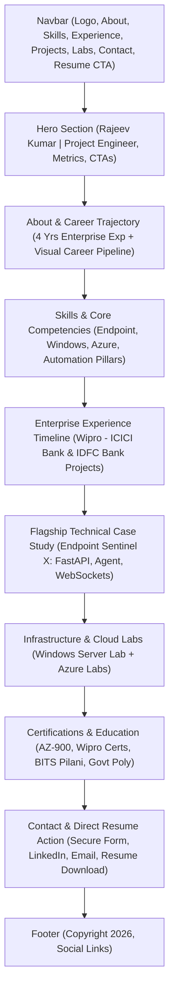

# Comprehensive Portfolio Audit & Optimization Strategy

**Candidate:** Rajeev (RJ) Kumar  
**Target Identity:** Project Engineer | IT Infrastructure | Windows Server | Azure | Endpoint Management | Intune | PowerShell | Automation  
**Target Trajectory:** Desktop Support → Endpoint Management → Windows Infrastructure → Windows Server → Azure → Cloud Infrastructure → Automation  
**Repository:** [ItsRjpatel.github.io](https://github.com/ItsRjpatel/ItsRjpatel.github.io)  
**Audit Date:** October 5, 2026  

---

## Executive Summary

This audit evaluates the portfolio repository (`d:\Project-nw`) to transform it into an elite, enterprise-grade engineering showcase. The portfolio currently has strong foundational aesthetics (dark theme, glassmorphism CSS, smooth scrolling) and genuine technical accomplishments (~4 years enterprise experience, ~400 users supported, 5L+ vulnerability remediations, Endpoint Sentinel X project). 

However, several critical bug fixes, privacy risks, career repositioning adjustments, and structural enhancements are required before proceeding to implementation.

---

## 1. Current Strengths

- **Modern Visual Theme:** Dark theme architecture with sleek CSS custom properties (`--bg-primary: #0a0a0f`, `--accent-cyan: #00d4ff`, `--gradient-hero`), glassmorphism cards, and interactive canvas particle background.
- **Solid Enterprise Impact Metrics:** High-value proof points already present (~400 users supported, 400–500 endpoints, 98% SLA compliance, 5L+ vulnerability findings remediated).
- **Strong Technical Project Foundation:** High-value flagship project **Endpoint Sentinel X** (FastAPI, Python, PostgreSQL, Redis, React, TypeScript, WebSockets) along with hands-on labs (**Windows Server Enterprise Lab** and **Azure Infrastructure Labs**).
- **Clean Architecture:** Zero heavy JavaScript framework overhead — pure semantic HTML5, Vanilla CSS3, and native JavaScript.

---

## 2. Problems Found

1. **Broken JavaScript Typing Animation (Bug):**
   - In `script.js` (Line 161), `initTypingAnimation()` attempts to query `document.getElementById('typing-text')`.
   - In `index.html` (Line 67), the element is `
IT Infrastructure Professional
` without a `#typing-text` element.
   - *Impact:* The typing animation silently crashes and never executes.
2. **Email Address Mismatch (Bug):**
   - `index.html` (Lines 529, 580) displays `itsrjwork@gmail.com`.
   - `script.js` (Line 358) hardcodes `mailto:itsrj2204@gmail.com`.
   - *Impact:* Contact form submissions send emails to a different address than displayed on the page.
3. **Unlinked Navigation Section:**
   - Section `#target` ("Career Target") exists in `index.html` (Line 492), but there is no link in the top navigation bar.
4. **Excessive Inline Styling:**
   - `index.html` contains raw inline styles (e.g., `style="grid-column: 1 / -1; display: flex..."` on Line 349, `style="padding-top: 40px..."` on Line 492).
   - *Impact:* Violates CSS separation of concerns and reduces maintainability.
5. **Unhedged Lucide CDN Dependency:**
   - Uses `` without offline fallback or error handling.
6. **Redundant Resume Assets in Workspace:**
   - Workspace contains three PDF files: `resume.pdf` (64 KB), `2resume.pdf` (682 KB), and `resume-Old.pdf` (40 KB). Only `resume.pdf` is referenced.

---

## 3. Outdated Information & Career Alignment Gaps

- **Title & Position Under-Representation:** Currently lists "Desktop Support (L1) @ Wipro". Needs immediate update to reflect current status as **Project Engineer at Wipro**.
- **Missing Explicit Career Pipeline:** Does not explicitly showcase the target career trajectory:
  `Desktop Support → Endpoint Management → Windows Infrastructure → Windows Server → Azure → Cloud Infrastructure → Automation`.
- **Under-Highlighted Core Capabilities:** Key enterprise tools like **Microsoft Intune, PowerShell, ServiceNow, Zscaler, and Patch Compliance** are buried as generic tags instead of being featured as primary skill pillars.

---

## 4. Privacy & Security Concerns (CRITICAL P0)

> [!CAUTION]
> **Action Required:** Remove or protect personal identifiers prior to any public deployment.

1. **Exposed Personal Phone Number:**
   - `index.html` (Lines 537–542) contains a direct clickable link with phone number: `tel:+916299614414` / `+91 6299614414`.
   - *Recommendation:* Remove direct phone exposure to prevent spam/scraping, replacing it with a direct LinkedIn connect action or contact form.
2. **Private Email Exposure:**
   - Secondary email (`itsrj2204@gmail.com`) in `script.js` exposes an unverified address.
3. **Resume File Audit:**
   - Ensure `resume.pdf` is free of Candidate IDs, Employee IDs, internal offer details, or full residential addresses.

---

## 5. UX/UI Improvements

- **Elevate Endpoint Sentinel X:** Currently rendered as a plain text block in a grid. Transform into a **Flagship Technical Case Study** with an interactive architecture layout, system metrics, and real-time command orchestration callouts.
- **Dedicated Infrastructure & Cloud Labs Section:** Create distinct visual showcase cards for **Windows Server Enterprise Lab** (AD DS, DNS, DHCP, GPO, Hyper-V) and **Azure Infrastructure Labs** (VMs, VNets, Resource Groups, App Services).
- **Interactive Tech Stack Pillars:** Reorganize skills into 4 distinct enterprise categories:
  1. Endpoint Management & IT Operations (Intune, ServiceNow, Zscaler, Win 10/11, Patch Compliance)
  2. Systems & Infrastructure (Windows Server, Active Directory, Group Policy, DNS, DHCP, PowerShell)
  3. Cloud Infrastructure & Virtualization (Azure, Azure VMs, VNets, Hyper-V, VMware)
  4. Automation & Enterprise Software (Python, FastAPI, PostgreSQL, Redis, Docker, WebSockets, REST APIs)
- **Visual Impact Cards:** Add prominent SLA counters (98%), User Support badges (~400 Users), and Vulnerability Metrics (5L+ findings remediated).

---

## 6. Technical Improvements

- **Fix JavaScript Execution:** Add `` to `index.html` and update `roles` in `script.js` to match target roles.
- **Unify Contact Flow:** Standardize email handling across `index.html` and `script.js` to `itsrjwork@gmail.com`.
- **Clean CSS Refactoring:** Replace inline HTML styles with modular CSS utility classes in `style.css`.
- **Resource Optimization:** Specify `width` and `height` dimensions on `profile.jpg` to eliminate Cumulative Layout Shift (CLS).

---

## 7. SEO Improvements

- **Page Title Tag:** Update from generic title to:  
  `<title>Rajeev (RJ) Kumar | Project Engineer — Endpoint Management, Windows Server & Azure</title>`
- **Meta Description:** Expand meta description:  
  `<meta name="description" content="Rajeev (RJ) Kumar is a Project Engineer with ~4 years of enterprise IT experience specializing in Endpoint Management, Microsoft Intune, Windows Server, Azure Infrastructure, PowerShell, and Enterprise Automation.">`
- **Keywords Meta Tag:** Update keywords to include `Project Engineer, Endpoint Management, Intune, Windows Server, Azure, PowerShell, Automation, Wipro, ServiceNow, Vulnerability Management`.
- **Open Graph & Metadata:** Add missing `og:image:alt`, `twitter:card`, `twitter:title`, and `twitter:description` tags.

---

## 8. Mobile & Responsive Issues

- **Hidden Mobile Badges:** Floating badges (`.floating-badge`) are hidden on screens `<768px` (`display: none`), removing key visual context on mobile devices.
  *Fix:* Render compact flex pills below the avatar image on mobile.
- **Mobile Hero Order:** On tablet/mobile screens, avatar floats above text (`order: 1` avatar, `order: 2` text), pushing the headline and CTA buttons down.
  *Fix:* Maintain hero text priority on mobile screens.
- **Mobile Menu Overlay:** Enhance drawer animation and ensure clean touch backdrop dismiss behavior.

---

## 9. Project Presentation Improvements

### Flagship Project: Endpoint Sentinel X
- **Current State:** Presented as a plain grid item with simple text bullets.
- **Target Presentation:** Elevated **Flagship Case Study** featuring:
  - Architecture breakdown: Windows Agent → FastAPI Backend → Redis Pub/Sub & WebSockets → React/TS Management Console.
  - Key Capabilities: System & OS Inventory, Online/Offline Health Monitoring, Security Risk Scoring, Real-time Remote Command Execution.
  - Interactive Technology Badges (FastAPI, Redis, PostgreSQL, WebSockets, Docker, Azure).

### Infrastructure Labs: Windows Server & Azure
- **Windows Server Enterprise Lab:** Highlight AD DS Forest deployment, Domain Controller configuration, DNS/DHCP scopes, Group Policy setup, and Hyper-V virtualization.
- **Azure Infrastructure Labs:** Highlight Azure VM provisioning, Virtual Network (VNet) peering & NSGs, Resource Management, and Azure App Service container hosting.

---

## 10. Recommended New Sections

1. **Hero Header:** Updated headline (Project Engineer), status pill, key metrics, and CTA buttons.
2. **About & Career Pipeline:** Enterprise background summary (~4 years) + explicit career direction graphic:
   `Desktop Support → Endpoint Management → Windows Infrastructure → Windows Server → Azure → Cloud Infrastructure → Automation`.
3. **Core Competencies (Skills):** Categorized into 4 enterprise technical pillars.
4. **Enterprise Experience:** Timeline detailing Wipro engagements (ICICI Bank & IDFC Bank projects) highlighting SLAs, ticket volume (~10/day), user counts (~400), and vulnerability remediations (5L+).
5. **Technical Case Study (Endpoint Sentinel X):** Deep-dive architecture and feature breakdown.
6. **Infrastructure Labs:** Windows Server Enterprise Lab & Azure Labs showcase.
7. **Certifications & Credentials:** AZ-900 Microsoft Azure Fundamentals, Wipro Internal Certifications (Windows Server L1/L2, EUC L2, Linux L1/L2), and Academic Background (BITS Pilani B.Tech awaiting results / Govt Poly Gaya Diploma).
8. **Resume & Contact:** Clean contact section with hidden personal phone number, unified email, and direct resume download.

---

## 11. Files That Need Modification

| File Path | Description of Required Modification |
| :--- | :--- |
| `index.html` | Update title/meta tags, career positioning to Project Engineer, fix `#typing-text` span, remove exposed phone number, restructure Projects section, and remove inline styles. |
| `script.js` | Fix `typing-text` selector bug, update role titles array, fix mailto email target mismatch, and add safety checks. |
| `style.css` | Add styling for Flagship Case Study, Career Pipeline graphic, responsive mobile tech pills, and replace inline HTML styles. |

---

## 12. Files That Should Remain Unchanged

| File Path | Status | Rationale |
| :--- | :--- | :--- |
| `profile.jpg` | **Keep Unchanged** | Clean, high-quality headshot avatar. |
| `resume.pdf` | **Keep Active File** | Primary resume PDF (Clean up `2resume.pdf` and `resume-Old.pdf` from workspace if requested). |

---

## 13. Priority Levels

### Priority 0 (P0 — Critical / Immediate Fixes)
- [x] **Remove Exposed Phone Number:** Mask/remove direct phone number (`+91 6299614414`) from `index.html` for privacy protection.
- [x] **Fix JavaScript Typing Bug:** Add `` in `index.html` so typing animation works properly.
- [x] **Fix Email Target Mismatch:** Align contact form email target to `itsrjwork@gmail.com` across HTML and JS.

### Priority 1 (P1 — Core Positioning & Content Enhancements)
- [x] **Reposition Career Role:** Update headline and summary to **Project Engineer at Wipro** specializing in Endpoint Management, Windows Server, Azure, and Automation.
- [x] **Elevate Endpoint Sentinel X:** Rebuild project card into a Flagship Technical Case Study.
- [x] **Add Career Pipeline Graphic:** Explicitly render career progression from Desktop Support to Cloud & Automation.
- [x] **Restructure Infrastructure Labs:** Create dedicated showcase blocks for Windows Server and Azure labs.
- [x] **SEO Overhaul:** Update `<title>`, `<meta description>`, and `<meta keywords>` tags.

### Priority 2 (P2 — UX/UI Refinements & Code Cleanliness)
- [x] **Eliminate Inline Styles:** Move all inline HTML styles to `style.css`.
- [x] **Mobile Responsive Badges:** Render compact tech pills under hero avatar on mobile devices.
- [x] **Clean Up Workspace:** Remove unused PDF files (`2resume.pdf`, `resume-Old.pdf`).

---

## Proposed Final Portfolio Structure

### Proposed Navigation Order
1. **Hero** (`#hero`)
2. **About** (`#about`)
3. **Skills** (`#skills`)
4. **Experience** (`#experience`)
5. **Flagship Project** (`#projects`)
6. **Infrastructure Labs** (`#labs`)
7. **Certifications** (`#education`)
8. **Contact** (`#contact`)

---

> [!NOTE]
> **Audit Status:** Complete. No code modifications have been made to the core website yet, in full compliance with Phase 1 instructions. Awaiting user approval to proceed with Phase 2 implementation.
