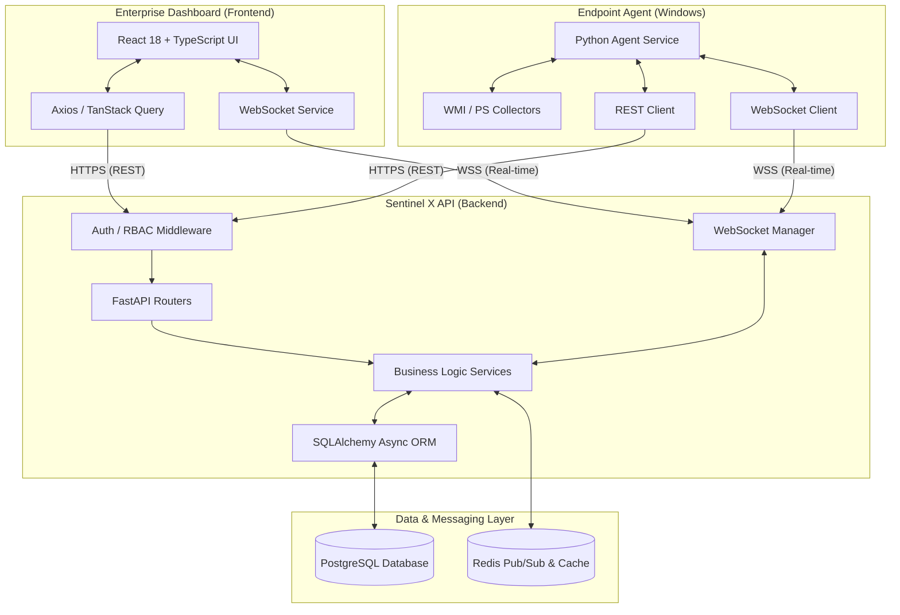

<div align="center">
  
  <h1>Endpoint Sentinel X</h1>
  <p><strong>Personal Engineering Project / Enterprise-style Endpoint Management Platform</strong></p>
  <p>
    
    
    
    
    
  </p>
</div>

---

## ⚡ 60-Second Recruiter Summary

**Endpoint Sentinel X** is a personal engineering project designed as an enterprise-style endpoint management and monitoring platform to deliver real-time system visibility, automated risk assessment, health telemetry, and real-time remote command orchestration across Windows endpoints.

Built as a lightweight alternative to commercial endpoint platforms like **Microsoft Intune** or **ManageEngine Endpoint Central**, it features an asynchronous **FastAPI** backend, persistent **WebSocket** channels, **Redis Pub/Sub**, and a native **Windows Agent Service** executing WMI and PowerShell telemetry collectors.

---

## 🎯 Problem & Solution

- **The Enterprise Challenge:** IT Administrators and Security Operations teams require real-time visibility into distributed endpoint health, hardware configurations, and active security posture without relying on slow manual polling.
- **The Sentinel Solution:** Engineered a lightweight client-agent architecture paired with non-blocking asynchronous REST and persistent WebSocket channels, enabling real-time command dispatch, live health telemetry, and automated alert resolution.

---

## 🏗️ Architecture & Component Stack



### 🔹 Component Breakdown
- **Backend API:** Python 3.13, FastAPI (Asynchronous REST + WebSockets), Pydantic v2 data validation, Alembic schema migrations.
- **Endpoint Agent:** Registered Windows Service (packaged via PyInstaller) running WMI & PowerShell metric collectors.
- **Data & Message Layer:** PostgreSQL (Async via `asyncpg`) for relational inventory and alert logs + Redis for Pub/Sub command dispatching & heartbeat caching.
- **Frontend Console:** React 18, TypeScript, Vite, Tailwind CSS, TanStack Query.
- **Security Operations:** JWT authentication, bcrypt/Argon2 password hashing, Role-Based Access Control (Super Admin, Operator, Security Analyst, Viewer), CORS policy enforcement.

---

## ✨ Implemented Core Capabilities

- 🖥️ **Hardware & OS Inventory:** Automatic collection of CPU, RAM, Disk partitions, and Network Interface specifications.
- ⏱️ **Real-Time Telemetry & Status:** Online/offline heartbeat detection and performance metrics collection.
- 🛡️ **Security Posture & Alerting:** Risk scoring, threat triage dashboard, and automated alert resolution workflows.
- ⚡ **Real-Time Command Dispatch:** Execution of remote system commands (scans, process termination, agent updates) via persistent WebSockets.
- 🐳 **Containerized Deployment:** Dockerized multi-container setup with Azure App Service deployment automation (`.github/workflows/main_sentinel-backend-x.yml`).

---

## 🛠️ Quick Local Setup

1. **Backend Setup:**
   ```bash
   cd backend
   python -m venv .venv
   source .venv/bin/activate  # On Windows: .venv\Scripts\activate
   pip install -e .
   alembic upgrade head
   python scripts/bootstrap.py
   uvicorn app.main:app --reload
   ```

2. **Frontend Setup:**
   ```bash
   cd frontend
   npm install
   npm run dev
   ```

3. **Interactive API Documentation:**
   Access OpenAPI / Swagger UI at `http://localhost:8000/docs`

---

## 📋 Security & Compliance Notes

- **Zero Hardcoded Credentials:** Environment variables managed via `.env` and Azure KeyVault integration.
- **RBAC Enforcement:** Route-level dependency injection enforcing user permissions.
- **Telemetry Integrity:** Agent token rotation and HMAC message verification.
